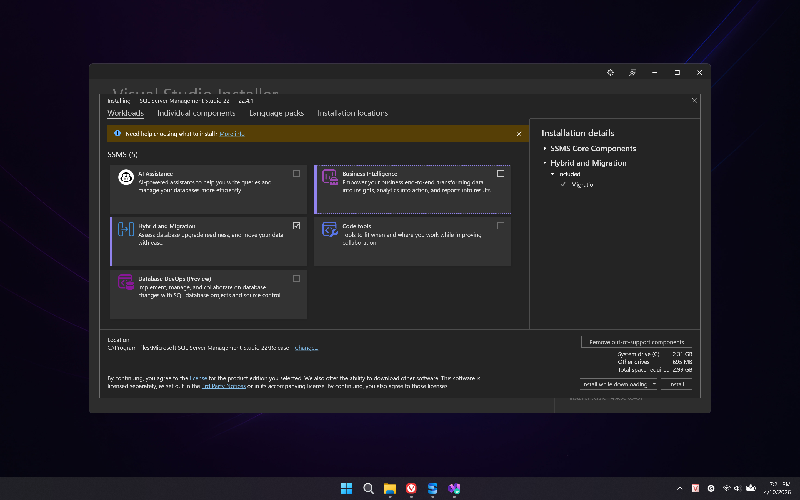
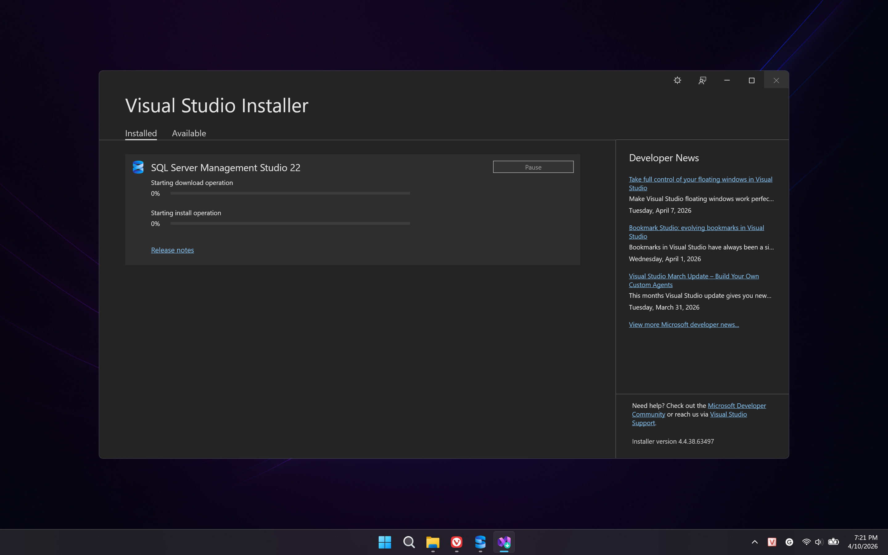
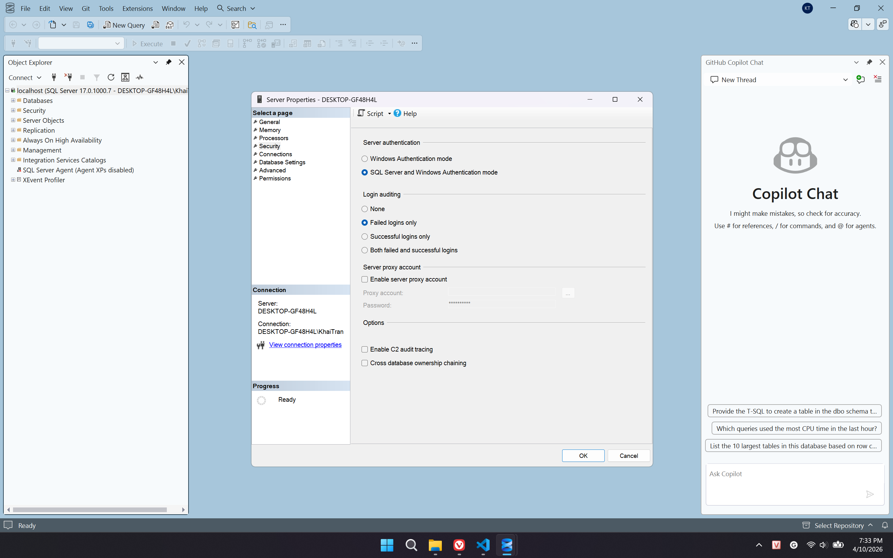
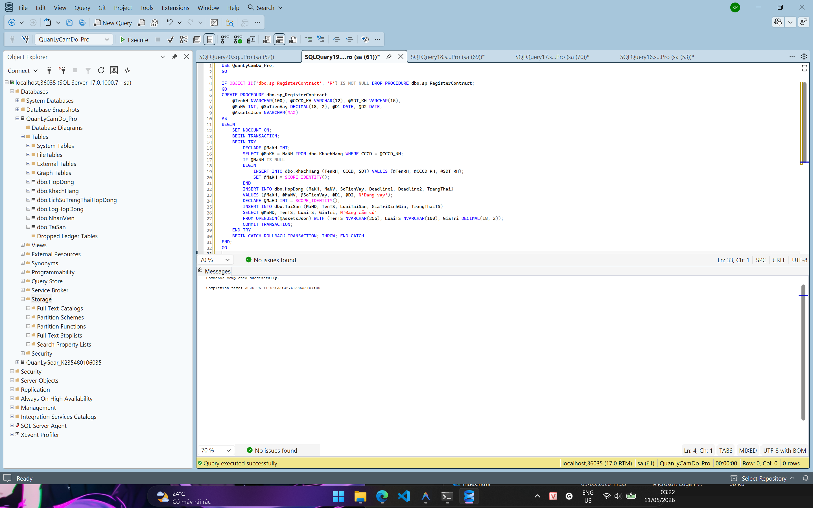
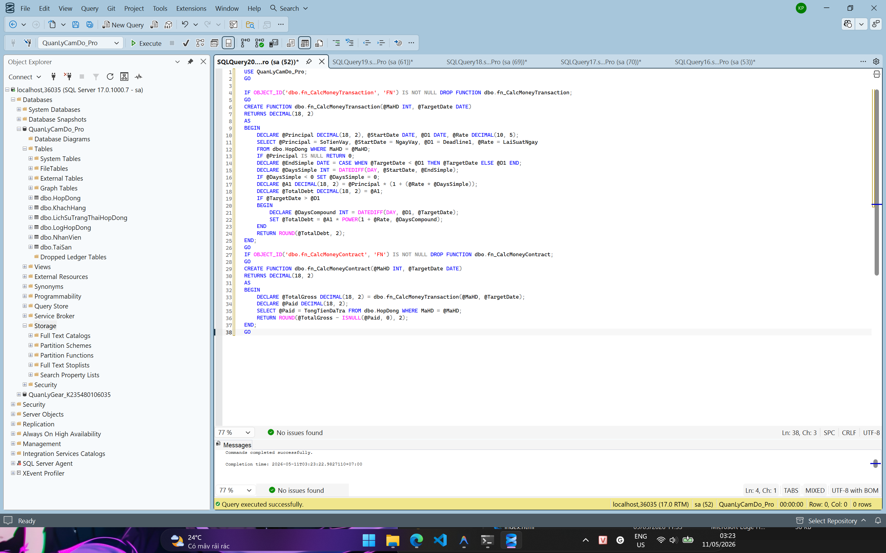
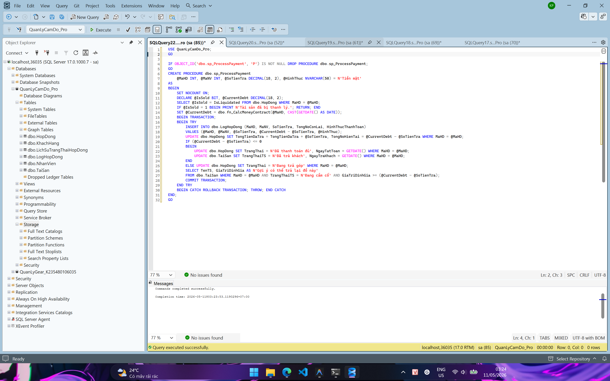
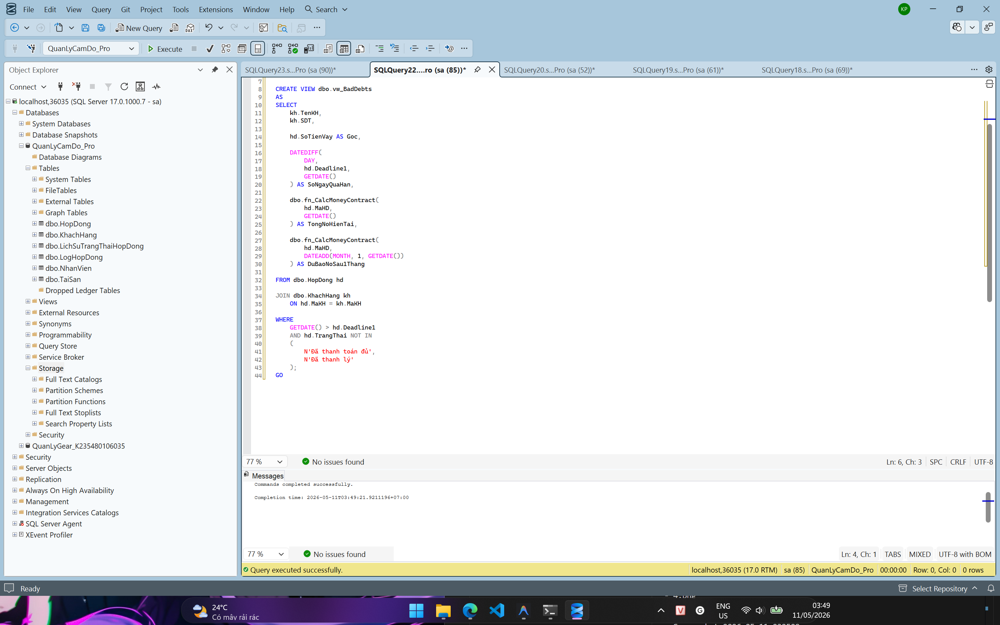
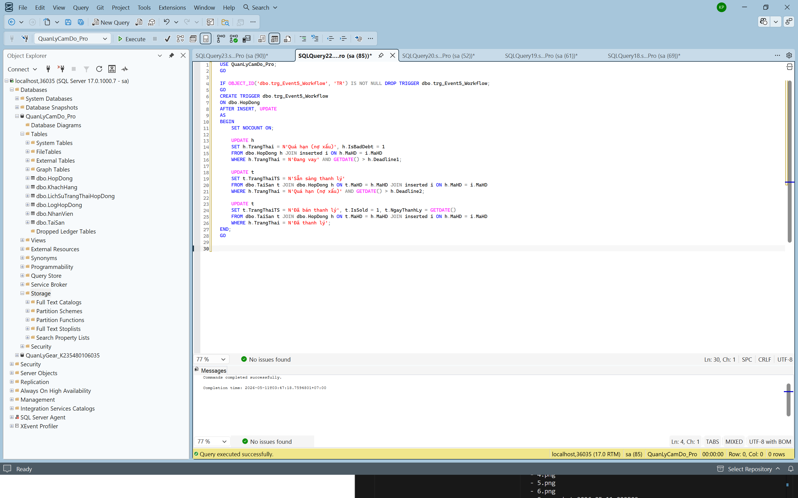
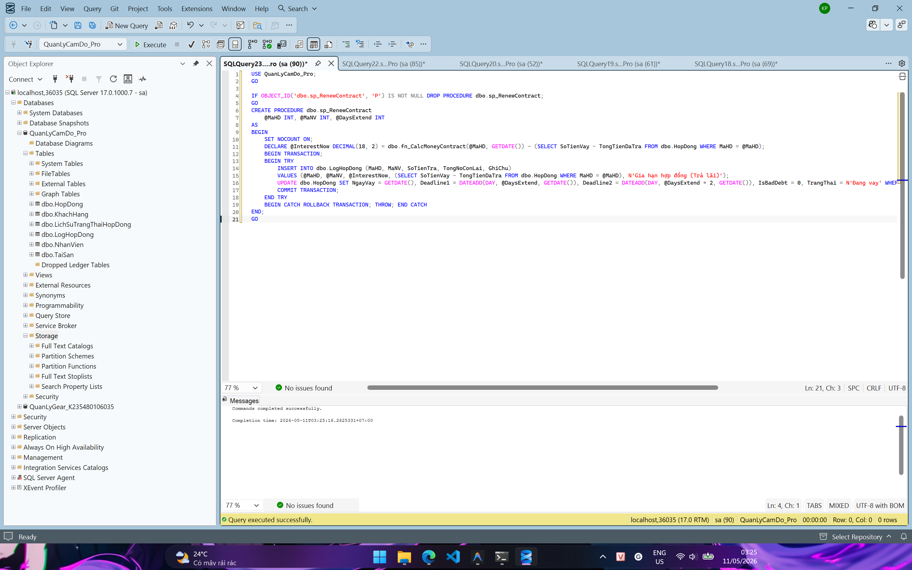
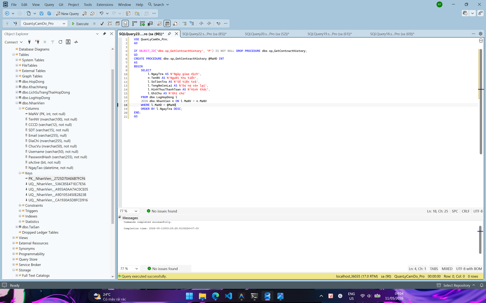

# BÁO CÁO BÀI TẬP VỀ NHÀ 03: THIẾT KẾ VÀ CÀI ĐẶT CSDL QUẢN LÝ CẦM ĐỒ

**Môn học:** Hệ quản trị CSDL  
**Lớp:** 59KMT  
**Giảng viên hướng dẫn:** Đỗ Duy Cốp  
**Sinh viên thực hiện:** Trần Văn Khải  
**MSSV:** K235480106035

---

## 1. Mô tả bài toán
Hệ thống quản lý các hợp đồng vay tiền thế chấp tài sản. Điểm đặc thù của hệ thống là cơ chế tính lãi linh hoạt: **Lãi đơn (5.000đ/1.000.000đ gốc/ngày)** áp dụng trước khi đến hạn, và **Lãi kép** áp dụng trên (Gốc + Lãi tích lũy) khi quá hạn mốc Deadline 1. Hệ thống quản lý danh mục tài sản thế chấp và xử lý thanh lý đồ khi quá hạn. Mọi biến động dòng tiền và trạng thái hợp đồng đều được lưu vết chi tiết (Audit Log) bao gồm cả thông tin người thu tiền (Mã nhân viên).

---

## 2. Thiết kế Cơ sở dữ liệu (Nhiệm vụ 1)

### 2.1. Sơ đồ thực thể quan hệ (ERD)


### 2.2. Cài đặt các bảng dữ liệu (3NF) - Trích xuất từ `baitapvenha3.sql`

**Bảng 1: Khách hàng (dbo.KhachHang)**

```sql
CREATE TABLE [dbo].[KhachHang](
    [MaKH] [int] IDENTITY(1, 1) PRIMARY KEY,
    [TenKH] [nvarchar](100) NOT NULL,
    [CCCD] [varchar](12) NOT NULL UNIQUE CHECK (LEN(CCCD) = 12),
    [SDT] [varchar](15) NOT NULL UNIQUE,
    [Email] [varchar](255),
    [DiaChi] [nvarchar](255),
    [NgaySinh] [date],
    [GioiTinh] [nvarchar](10),
    [GhiChu] [nvarchar](max),
    [NgayTao] [datetime] DEFAULT GETDATE()
);
```

**Bảng 2: Nhân viên (dbo.NhanVien)**

```sql
CREATE TABLE [dbo].[NhanVien](
    [MaNV] [int] IDENTITY(1, 1) PRIMARY KEY,
    [TenNV] [nvarchar](100) NOT NULL,
    [CCCD] [varchar](12) NOT NULL UNIQUE CHECK (LEN(CCCD) = 12),
    [SDT] [varchar](15) NOT NULL UNIQUE,
    [Email] [varchar](255) UNIQUE,
    [DiaChi] [nvarchar](255),
    [ChucVu] [nvarchar](50) DEFAULT N'Nhân viên',
    [Username] [varchar](50) NOT NULL UNIQUE,
    [PasswordHash] [varchar](255) NOT NULL,
    [IsActive] [bit] DEFAULT 1,
    [NgayTao] [datetime] DEFAULT GETDATE()
);
```

**Bảng 3: Hợp đồng (dbo.HopDong)**

```sql
CREATE TABLE [dbo].[HopDong](
    [MaHD] [int] IDENTITY(1, 1) PRIMARY KEY,
    [MaKH] [int] NOT NULL,
    [MaNV] [int] NOT NULL,
    [NgayVay] [date] DEFAULT GETDATE(),
    [SoTienVay] [decimal](18, 2) NOT NULL CHECK (SoTienVay > 0),
    [LaiSuatNgay] [decimal](10, 5) DEFAULT 0.005,
    [Deadline1] [date] NOT NULL,
    [Deadline2] [date] NOT NULL,
    [TongTienDaTra] [decimal](18, 2) DEFAULT 0,
    [TongNoHienTai] [decimal](18, 2) DEFAULT 0,
    [TrangThai] [nvarchar](50) DEFAULT N'Đang vay', -- Đang vay, Quá hạn (nợ xấu), Đã thanh toán, Đã thanh lý tài sản
    [MoTa] [nvarchar](max),
    [IsBadDebt] [bit] DEFAULT 0,
    [IsLiquidated] [bit] DEFAULT 0,
    [NgayTatToan] [datetime],
    [NgayTao] [datetime] DEFAULT GETDATE(),
    CONSTRAINT FK_HopDong_KhachHang FOREIGN KEY (MaKH) REFERENCES dbo.KhachHang(MaKH),
    CONSTRAINT FK_HopDong_NhanVien FOREIGN KEY (MaNV) REFERENCES dbo.NhanVien(MaNV),
    CONSTRAINT CK_HopDong_Deadline CHECK (Deadline2 > Deadline1)
);
```

**Bảng 4: Tài sản (dbo.TaiSan)**

```sql
CREATE TABLE [dbo].[TaiSan](
    [MaTS] [int] IDENTITY(1, 1) PRIMARY KEY,
    [MaHD] [int] NOT NULL,
    [TenTS] [nvarchar](255) NOT NULL,
    [LoaiTaiSan] [nvarchar](100) NOT NULL,
    [ThuongHieu] [nvarchar](100),
    [Model] [nvarchar](100),
    [MauSac] [nvarchar](50),
    [SerialNumber] [varchar](100),
    [MoTa] [nvarchar](max),
    [GiaTriDinhGia] [decimal](18, 2) NOT NULL CHECK (GiaTriDinhGia >= 0),
    [GiaThanhLy] [decimal](18, 2),
    [TrangThaiTS] [nvarchar](50) DEFAULT N'Đang cầm cố',
    [IsSold] [bit] DEFAULT 0,
    [NgayNhapKho] [datetime] DEFAULT GETDATE(),
    [NgayTraKhach] [datetime],
    [NgayThanhLy] [datetime],
    [GhiChu] [nvarchar](max),
    CONSTRAINT FK_TaiSan_HopDong FOREIGN KEY (MaHD) REFERENCES dbo.HopDong(MaHD)
);
```

**Bảng 5: Nhật ký hợp đồng (dbo.LogHopDong)**

```sql
CREATE TABLE [dbo].[LogHopDong](
    [MaLog] [int] IDENTITY(1, 1) PRIMARY KEY,
    [MaHD] [int] NOT NULL,
    [MaNV] [int] NOT NULL, -- Người thu tiền (Audit Log)
    [NgayTra] [datetime] DEFAULT GETDATE(),
    [SoTienTra] [decimal](18, 2) NOT NULL CHECK (SoTienTra > 0),
    [TienGocDaThu] [decimal](18, 2) DEFAULT 0,
    [TienLaiDaThu] [decimal](18, 2) DEFAULT 0,
    [DuNoGocConLai] [decimal](18, 2) DEFAULT 0,
    [TongNoConLai] [decimal](18, 2) DEFAULT 0,
    [HinhThucThanhToan] [nvarchar](50) DEFAULT N'Tiền mặt',
    [GhiChu] [nvarchar](max),
    CONSTRAINT FK_LogHopDong_HopDong FOREIGN KEY (MaHD) REFERENCES dbo.HopDong(MaHD),
    CONSTRAINT FK_LogHopDong_NhanVien FOREIGN KEY (MaNV) REFERENCES dbo.NhanVien(MaNV)
);
```

**Bảng 6: Lịch sử trạng thái (dbo.LichSuTrangThaiHopDong)**

```sql
CREATE TABLE [dbo].[LichSuTrangThaiHopDong](
    [MaLS] [int] IDENTITY(1, 1) PRIMARY KEY,
    [MaHD] [int] NOT NULL,
    [MaNV] [int],
    [TrangThaiCu] [nvarchar](50),
    [TrangThaiMoi] [nvarchar](50) NOT NULL,
    [ThoiGianThayDoi] [datetime] DEFAULT GETDATE(),
    [GhiChu] [nvarchar](max),
    CONSTRAINT FK_LichSuTrangThai_HopDong FOREIGN KEY (MaHD) REFERENCES dbo.HopDong(MaHD),
    CONSTRAINT FK_LichSuTrangThai_NhanVien FOREIGN KEY (MaNV) REFERENCES dbo.NhanVien(MaNV)
);
```

### 2.3. Ràng buộc và Toàn vẹn dữ liệu
Hệ thống áp dụng các ràng buộc chặt chẽ để đảm bảo chất lượng dữ liệu:
- **CHECK Constraints:** Kiểm tra độ dài CCCD (12 ký tự), số tiền vay/trả phải dương, giá trị định giá không âm, và ngày hết hạn sau (`Deadline2`) phải lớn hơn ngày hết hạn trước (`Deadline1`).
- **DEFAULT Constraints:** Tự động điền ngày tạo (`GETDATE()`), trạng thái mặc định (`Đang vay`, `Đang cầm cố`), và các giá trị tài chính ban đầu bằng 0.
- **UNIQUE Constraints:** Đảm bảo không trùng lặp CCCD, Số điện thoại, Email và Username.
- **FOREIGN KEY Constraints:** Thiết lập mối quan hệ cha-con giữa Khách hàng/Nhân viên với Hợp đồng, và giữa Hợp đồng với Tài sản/Nhật ký giao dịch.

---

## 3. Các sự kiện nghiệp vụ (Events)

### 3.1. Event 1: Đăng ký hợp đồng mới (JSON-based)

*Sử dụng OPENJSON để bóc tách danh sách tài sản từ chuỗi JSON đầu vào, đảm bảo tính nguyên tử (Atomic) thông qua Transaction.*

### 3.2. Event 2: Tính toán công nợ thời gian thực (Compound Interest)

- **Hàm `fn_CalcMoneyContract`:** Tính toán tổng số tiền khách phải trả (Gốc + Lãi đơn + Lãi kép) tính đến ngày `TargetDate`.
- **Công thức tính toán:**
    1. **Lãi đơn (Trước hoặc tại Deadline 1):**
       $$A_1 = P \times (1 + r \times n_1)$$
       *($P$: Gốc, $r$: Lãi suất 5.000đ/1.000.000đ/ngày = 0.005, $n_1$: Số ngày vay thực tế $\leq$ Deadline 1)*
    2. **Lãi kép (Sau Deadline 1):** Toàn bộ dư nợ tại mốc Deadline 1 ($A_1$) sẽ trở thành gốc mới để tính lãi lũy tiến theo ngày.
       $$A_{final} = A_1 \times (1 + r)^{n_2}$$
       *($n_2$: Số ngày quá hạn tính từ sau Deadline 1)*
- **Cài đặt:** Sử dụng hàm `POWER(1 + @Rate, @DaysCompound)` trong SQL để tính toán chính xác số dư nợ theo thời gian thực.

### 3.3. Event 3: Xử lý trả nợ và Audit Log

*Ghi nhận dòng tiền chi tiết vào bảng Log, tự động cập nhật trạng thái hợp đồng và tài sản khi khách trả đủ tiền.*

### 3.4. Event 4: Truy vấn danh sách nợ xấu (View)

*View tổng hợp các hợp đồng quá hạn kèm dự báo nợ sau 1 tháng để phục vụ bộ phận thu hồi nợ.*

### 3.5. Event 5: Quản lý workflow trạng thái (Triggers)

Hệ thống sử dụng 3 Trigger chính để tự động hóa quy trình:
- **Trigger 1:** Chuyển trạng thái Hợp đồng từ `Đang vay` sang `Quá hạn (nợ xấu)` khi vượt mốc `Deadline 1`.
- **Trigger 2:** Chuyển trạng thái Tài sản sang `Sẵn sàng thanh lý` khi Hợp đồng vượt mốc `Deadline 2`.
- **Trigger 3:** Khi Hợp đồng chuyển sang `Đã thanh lý tài sản`, tự động cập nhật Tài sản tương ứng sang trạng thái `Đã bán thanh lý`.

---

## 4. Các sự kiện bổ sung (Audit & Renewal)

### 4.1. Gia hạn hợp đồng

- **Cơ chế:** Khách hàng trả tiền lãi phát sinh để được dời ngày Deadline, giúp giảm áp lực tài chính và tránh việc bị thanh lý tài sản.

### 4.2. Truy vết lịch sử giao dịch

- **Cơ chế:** Truy vấn toàn bộ lịch sử trả nợ từ bảng Audit Log của một hợp đồng cụ thể, minh bạch hóa quá trình tất toán.

---

## 5. Dữ liệu mẫu (Sample Data) - Trích xuất từ `script.sql`

Kịch bản chèn dữ liệu mẫu bao gồm ít nhất **10 bản ghi cho mỗi bảng** để kiểm tra toàn diện các trường hợp:

```sql
-- 1. CHÈN NHÂN VIÊN (Tổng 10 bản ghi trong script.sql)
INSERT INTO dbo.NhanVien (TenNV, CCCD, SDT, DiaChi, Email, ChucVu, Username, PasswordHash)
VALUES 
(N'Nguyễn Văn Minh', '001203004567', '0912345678', N'Hà Nội', 'staff01@gmail.com', N'Nhân viên', 'staff01', 'pass1'),
(N'Lê Thị Thu Ngân', '001203004888', '0988776655', N'Hà Nội', 'ngan@gmail.com', N'Kế toán', 'nganle', 'pass2'),
-- ... (xem chi tiết tại script.sql)

-- 2. CHÈN KHÁCH HÀNG (Tổng 10 bản ghi trong script.sql)
INSERT INTO dbo.KhachHang (TenKH, CCCD, SDT, DiaChi, NgaySinh)
VALUES 
(N'Lê Văn Nam', '035201004567', '0987654321', N'Thái Nguyên', '2004-03-15'),
(N'Phạm Minh Tuấn', '035201001111', '0901234567', N'Hà Nội', '1995-05-20'),
-- ... (xem chi tiết tại script.sql)

-- 3. ĐĂNG KÝ HỢP ĐỒNG (Tạo 10 hợp đồng mẫu qua SP)
DECLARE @Json NVARCHAR(MAX) = N'[{"TenTS": "iPhone 15 Pro Max", "LoaiTS": "Điện thoại", "GiaTri": 25000000}]';
EXEC dbo.sp_RegisterContract N'Lê Văn Nam', '035201004567', '0987654321', 1, 15000000, '2026-05-01', '2026-06-01', @Json;

-- 4. THỰC HIỆN GIAO DỊCH TRẢ NỢ (10 bản ghi Log)
EXEC dbo.sp_ProcessPayment @MaHD = 1, @MaNV = 1, @SoTienTra = 2000000, @HinhThuc = N'Tiền mặt';
```

---
*Báo cáo được trình bày bởi Trần Văn Khải - MSSV: K235480106035.*
