# BAITAP1_HCSQTDL  
## THỰC HÀNH HỆ QUẢN TRỊ CƠ SỞ DỮ LIỆU - BÀI SỐ 1  

---

## THÔNG TIN SINH VIÊN

- Họ và tên: Trần Văn Khải  
- Mã sinh viên: K235480106035  
- Lớp: K59.KMT  
- Học phần: Hệ quản trị dữ liệu  

---

# CHI TIẾT CÁC BƯỚC THỰC HIỆN

## 1. Cài đặt và cấu hình môi trường (Yêu cầu 1 - 5)

Thực hiện cài đặt SQL Server 2025 Standard Developer Edition, SSMS và cấu hình TCP/IP Port 1433 để chuẩn bị môi trường thực hành.

---

### 1.1 Trạng thái cài đặt SQL Server thành công

Trạng thái cài đặt SQL Server thành công.

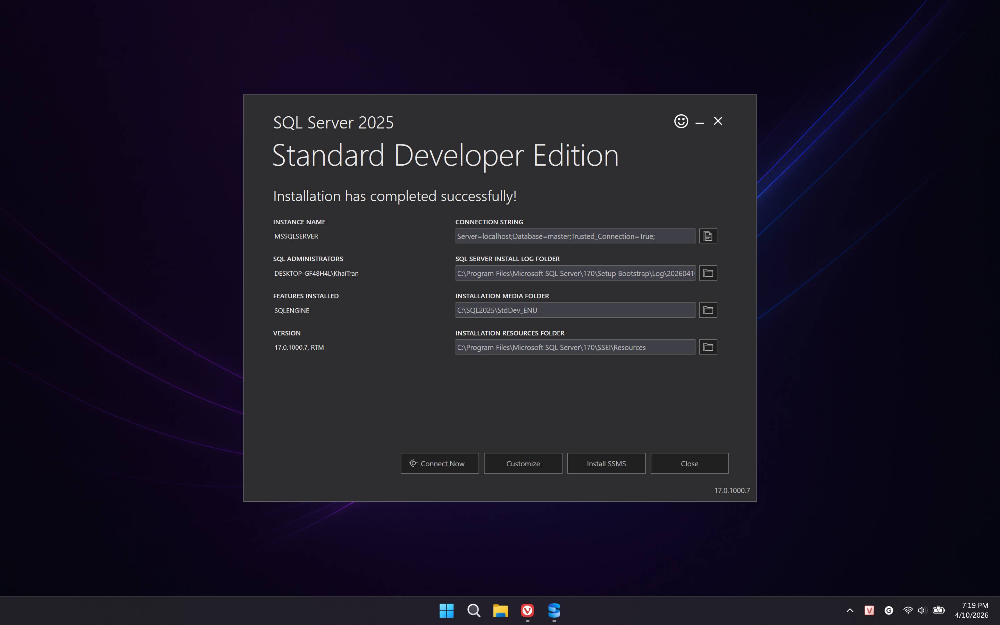

---

## 1.2 Kích hoạt giao thức TCP/IP trong SQL Server Configuration Manager

Thực hiện bật giao thức TCP/IP trong SQL Server Configuration Manager.
- Enable TCP/IP
  


---

- Cấu hình chi tiết TCP/IP
  
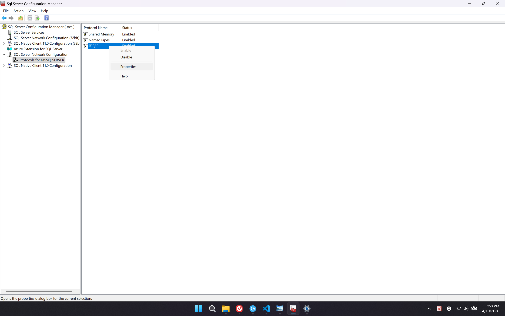

---

- Listen ALL = YES

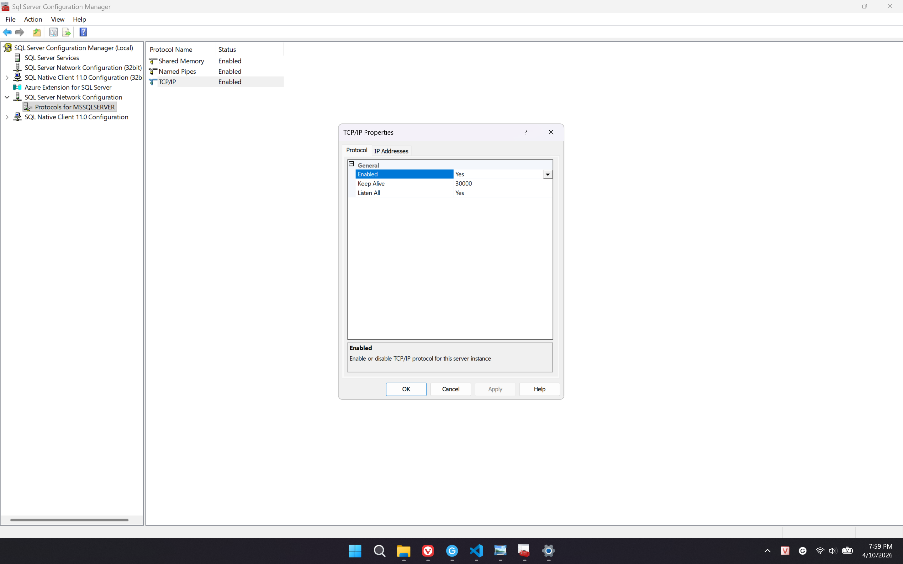

---

- IP Address + Dynamic Port

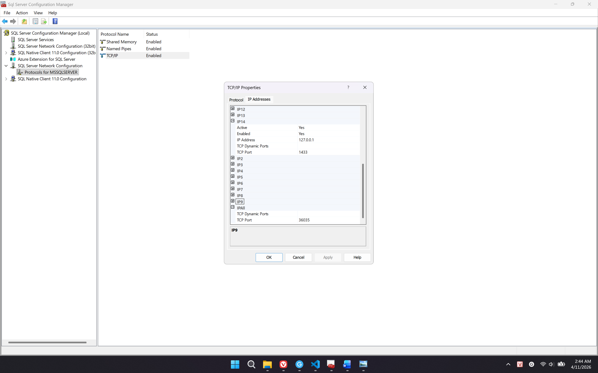

---

## 1.3 Kiểm tra SQL Server Service

Kiểm tra service SQL Server có đang chạy và cổng kết nối có hoạt động hay không.


---

## 1.4 Cài đặt SQL Server Management Studio (SSMS)

Thực hiện cài đặt phần mềm SSMS.

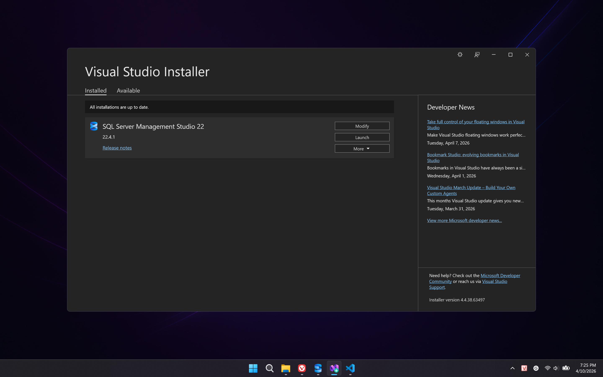

---

## 1.5 Đăng nhập vào SQL Server bằng SSMS

Mở SSMS và tiến hành đăng nhập hệ thống.
- Kết nối bằng Windows Authentication
  


---

- Kết nối bằng username và password
  


---

- Enable login tài khoản sa

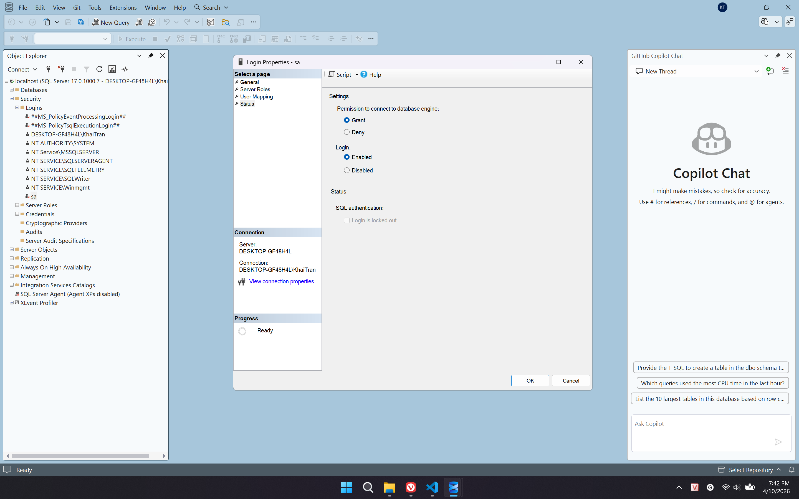

---

- Kết quả đăng nhập thành công
  
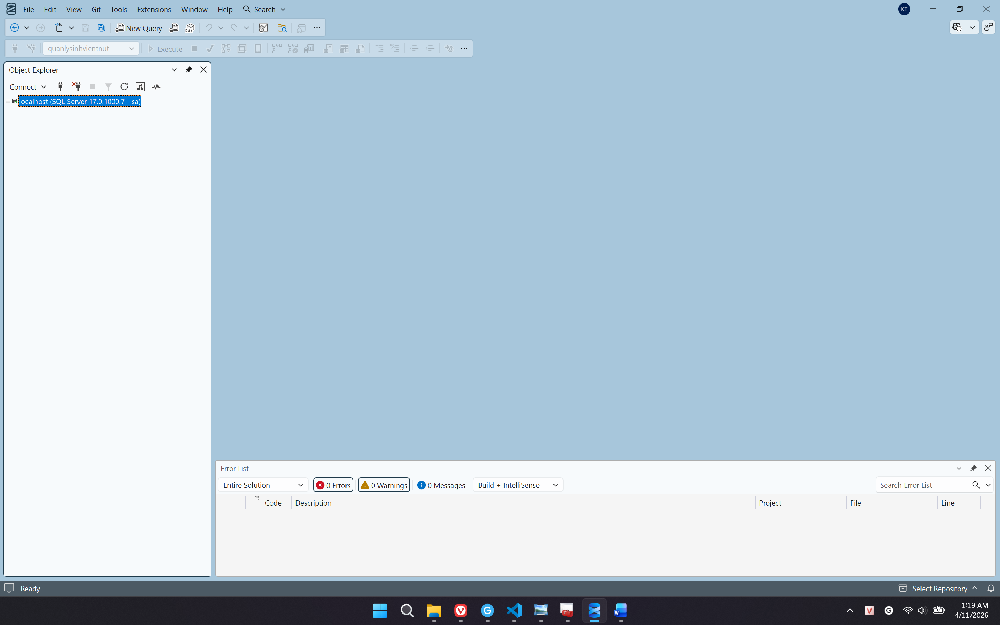

---

## 2. Tạo Cơ sở dữ liệu (Yêu cầu 6)

Tạo Database `quanlysinhvientnut` và thiết lập nơi lưu trữ các tệp vật lý nhằm tối ưu hóa hiệu suất và quản lý dữ liệu dễ dàng hơn.

---

### 2.1 Cấu hình Path cho tệp .mdf (Data) và .ldf (Log)


---

## 3. Khởi tạo cấu trúc bảng (Yêu cầu 7)

Tạo bảng `danhsachsinhvien` với các trường dữ liệu phù hợp để lưu thông tin sinh viên.

### Câu lệnh SQL

```sql
create table danhsachsinhvien (
    masv VARCHAR(50) PRIMARY KEY,
    hotensv NVARCHAR(100),
    malop NVARCHAR(50),
    ngaysinh VARCHAR(20),
    noisinh NVARCHAR(100),
    diachi NVARCHAR(500)
);

```
### Kết quả tạo bảng


---

## 4. Nạp dữ liệu từ tệp CSV (Yêu cầu 8)

Sử dụng lệnh `BULK INSERT` để nạp dữ liệu từ file `svtnut.csv` vào bảng `danhsachsinhvien`.

---

### Câu lệnh SQL

```sql
bulk insert danhsachsinhvien
from 'D:\thuchanhsql\svtnut.csv'
with (
    firstrow = 2,
    format = 'CSV',
    codepage = '65001'
);
```
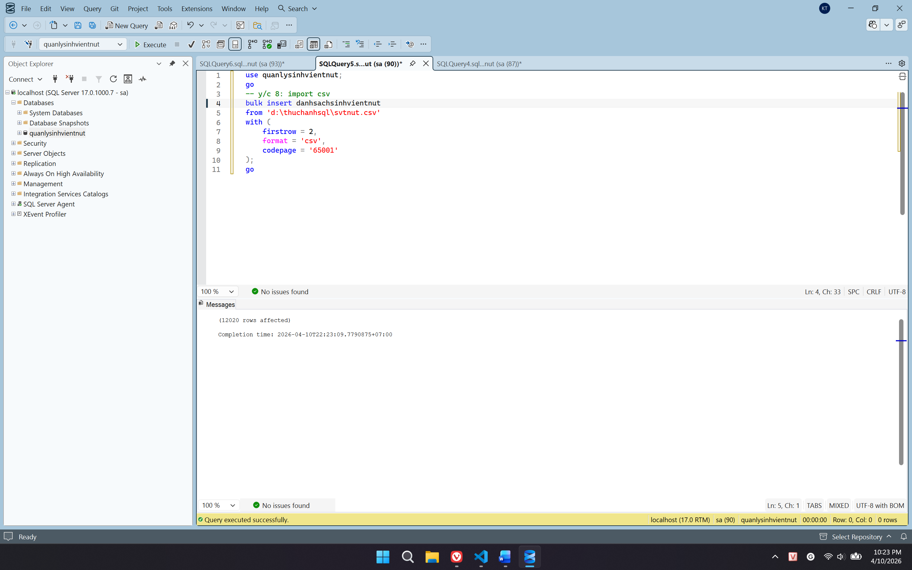

---
## 5. Kiểm tra và Ghi danh cá nhân (Yêu cầu 9 - 10)

Xác nhận tổng số dòng trong cơ sở dữ liệu và thêm bản ghi chứa thông tin cá nhân của sinh viên thực hiện bài Lab.

---

### 5.1 Kiểm tra số lượng dòng bằng COUNT()

### Câu lệnh SQL

```sql
select count(*) from danhsachsinhvien;
go
```
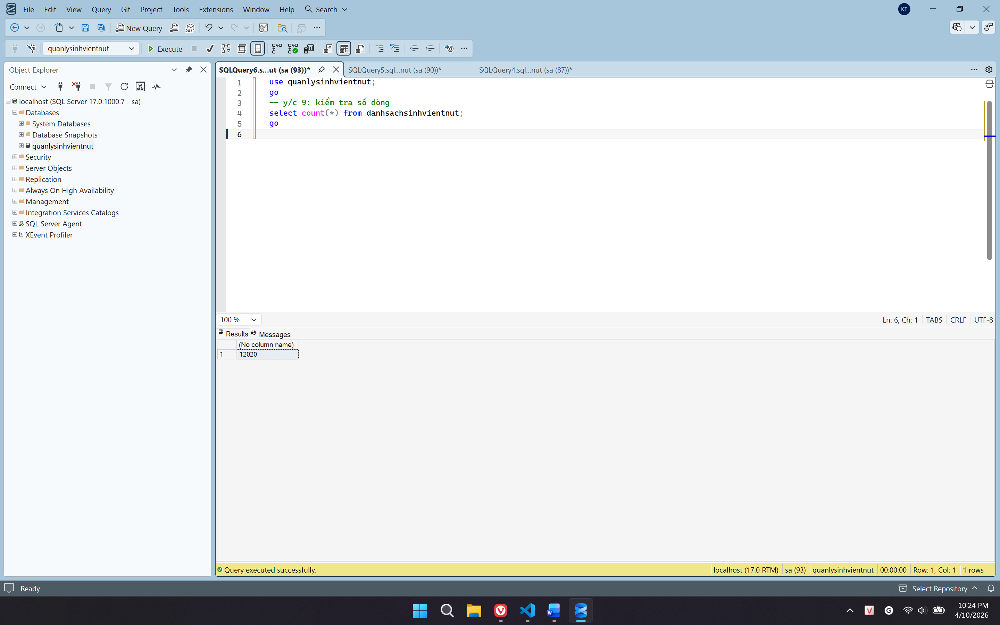
---

### 5.2 Thêm bản ghi sinh viên Trần Văn Khải

### Câu lệnh SQL

```sql
insert into danhsachsinhvien (masv, hotensv, malop, ngaysinh, noisinh, diachi)
values ('K235480106035', N'Trần Văn Khải', N'K59.KMT', '2005-01-28', N'Bắc Giang', N'Việt Nam');
go
```
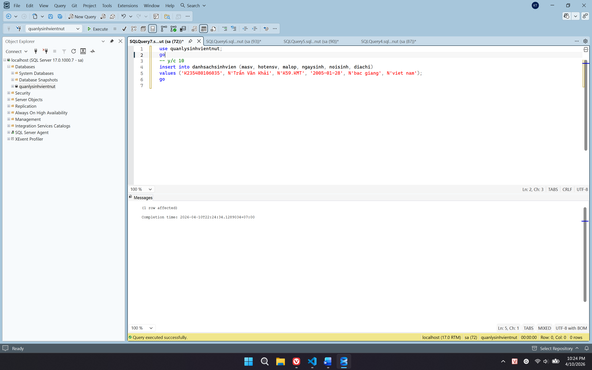
## 6. Xử lý dữ liệu và Tạo bảng phụ (Yêu cầu 11 – 13)

---

### 6.1 Cập nhật dữ liệu NULL → "Sao Hỏa"

### Câu lệnh SQL

```sql
use quanlysinhvientnut;
go
-- yc 11
update danhsachsinhvien
set noisinh = n'sao hỏa'
where (noisinh is null or noisinh = 'null')
  and (diachi is null or diachi = 'null');
go
```
Cập nhật trường `noisinh` thành `"Sao Hỏa"` với các bản ghi có cả `noisinh` và `diachi` đều NULL.


---

### 6.2 Tạo bảng SaoHoa bằng SELECT INTO

### Câu lệnh SQL

```sql
select *
into saohoa
from danhsachsinhvien
where noisinh = n'sao hoả';
go
```

Tách các sinh viên có `noisinh = 'Sao Hỏa'` sang bảng mới `SaoHoa`.

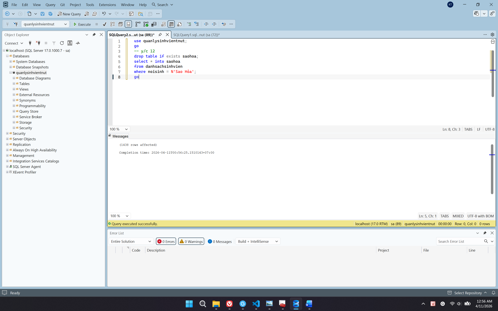

---

### 6.3 Xóa sinh viên theo họ trong bảng SaoHoa

Xóa các sinh viên có họ Trần trong bảng `SaoHoa`.

### Câu lệnh SQL

```sql
delete from saohoa
where hotensv like n'tran%';
go
```

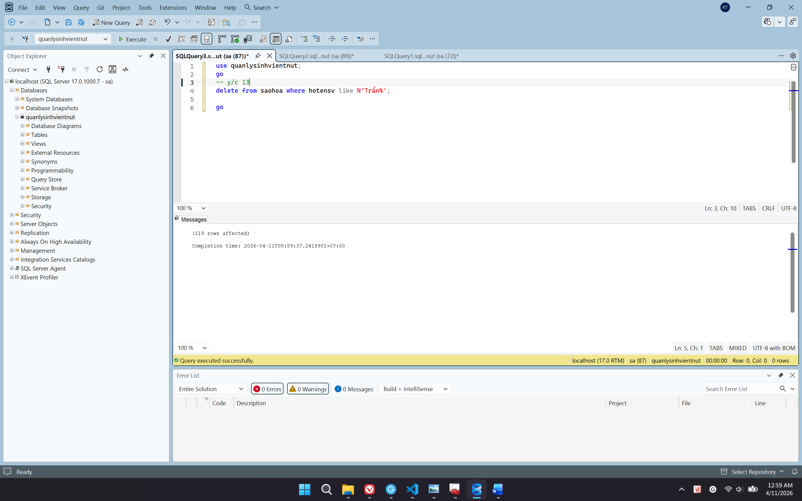
---

### 6.4 Kiểm tra số lượng dòng giữa hai bảng

### Câu lệnh SQL

```sql
select 'danhsachsinhvientnut' as TenBang, count(*) as SoLuong from danhsachsinhvien 
union all
select 'SaoHoa' AS TenBang, count(*) as SoLuong from SaoHoa;
```
Sử dụng `UNION ALL` để so sánh số lượng bản ghi giữa bảng gốc và bảng phụ sau khi lọc dữ liệu.

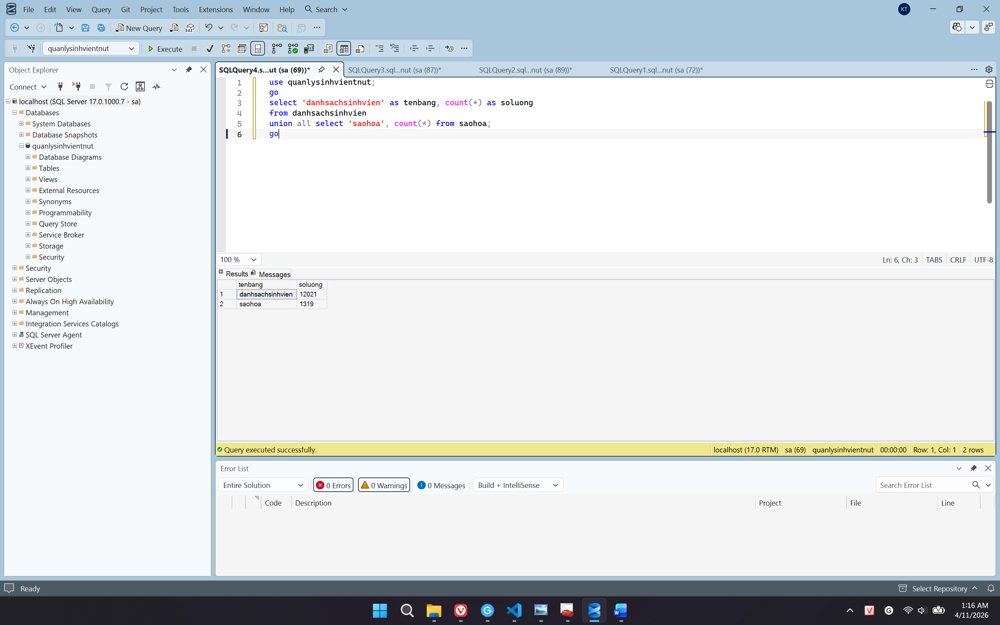

## 7. Xuất Script tổng hợp (Yêu cầu 14)

Sử dụng tính năng **Generate Scripts** để sao lưu toàn bộ cấu trúc bảng và dữ liệu (Schema and Data) ra tệp tin script.

---

### 7.1 Chọn chế độ "Schema and Data" trong Advanced Options

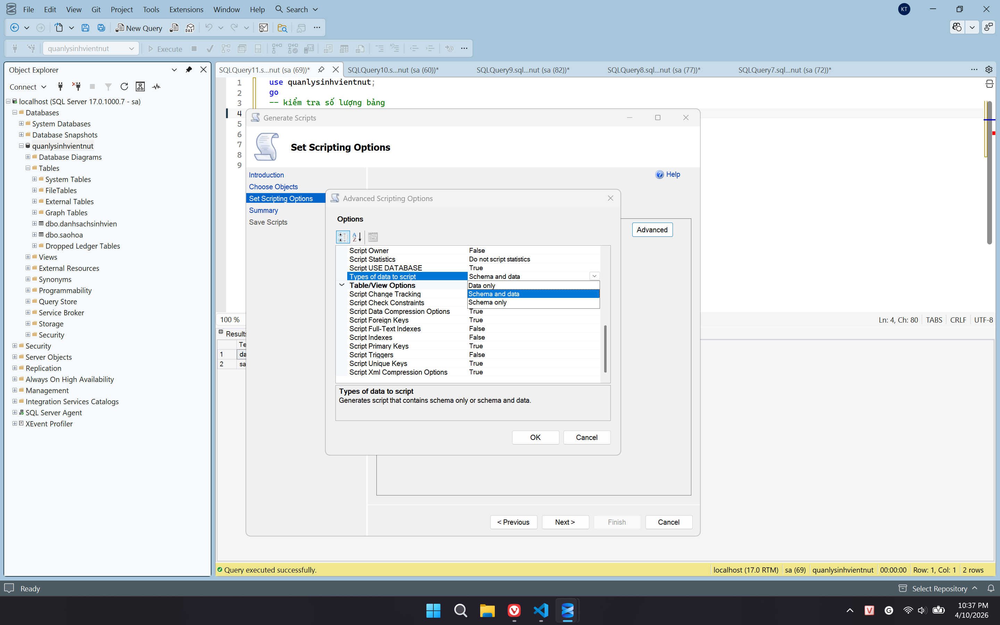

---

### 7.2 Xuất file `dulieu.sql` thành công

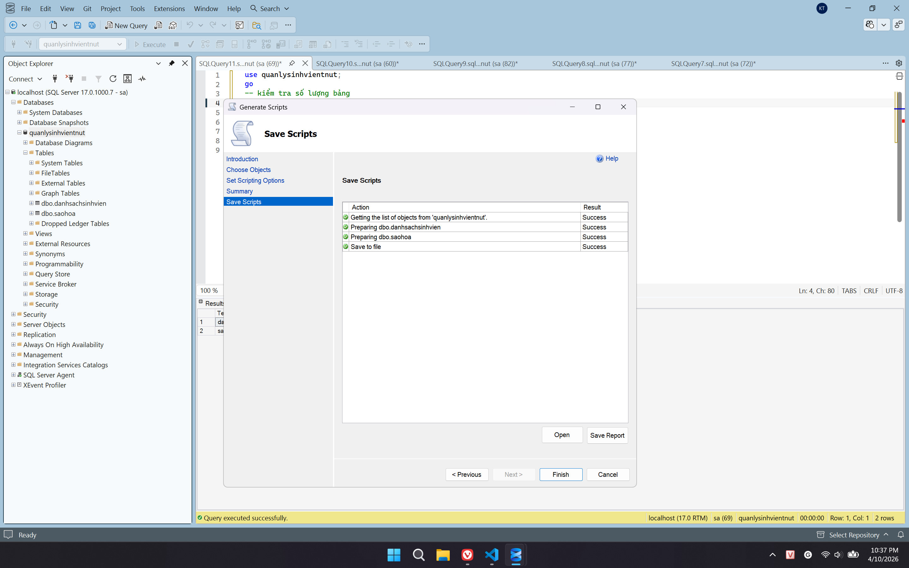

---

## 8. Xóa Database và kiểm tra tệp vật lý (Yêu cầu 15)

Thực hiện xóa Database trên giao diện SSMS và kiểm tra thư mục lưu trữ để xác nhận các tệp `.mdf` và `.ldf` đã được xóa sạch khỏi ổ đĩa.

---

### 8.1 Xóa Database bằng giao diện SSMS

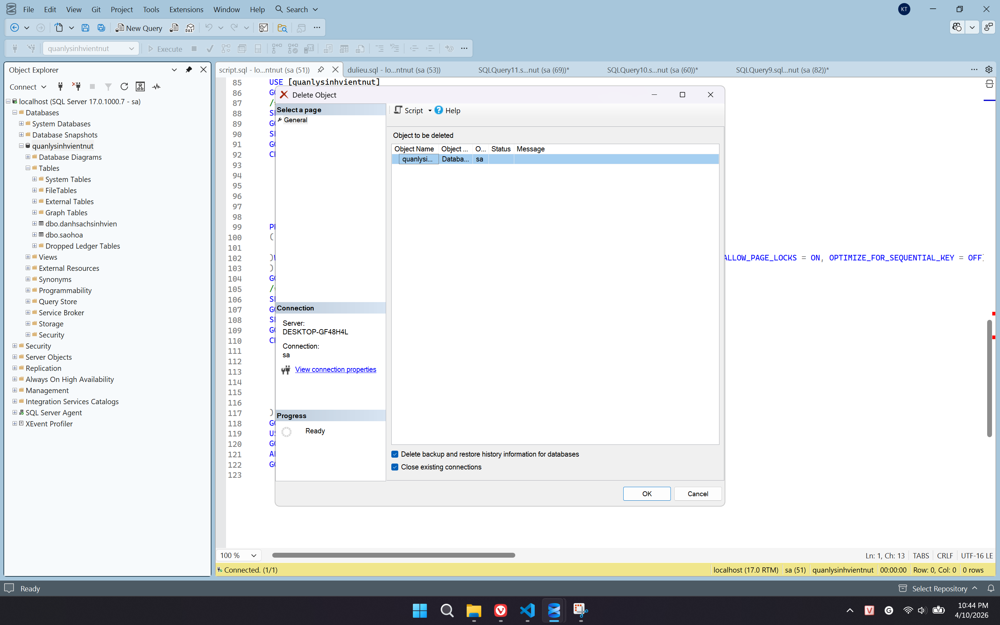

---

### 8.2 Kiểm tra thư mục dữ liệu sau khi xóa

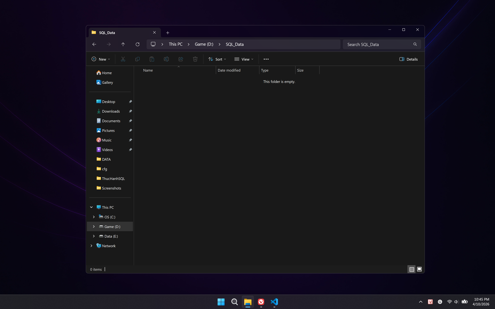

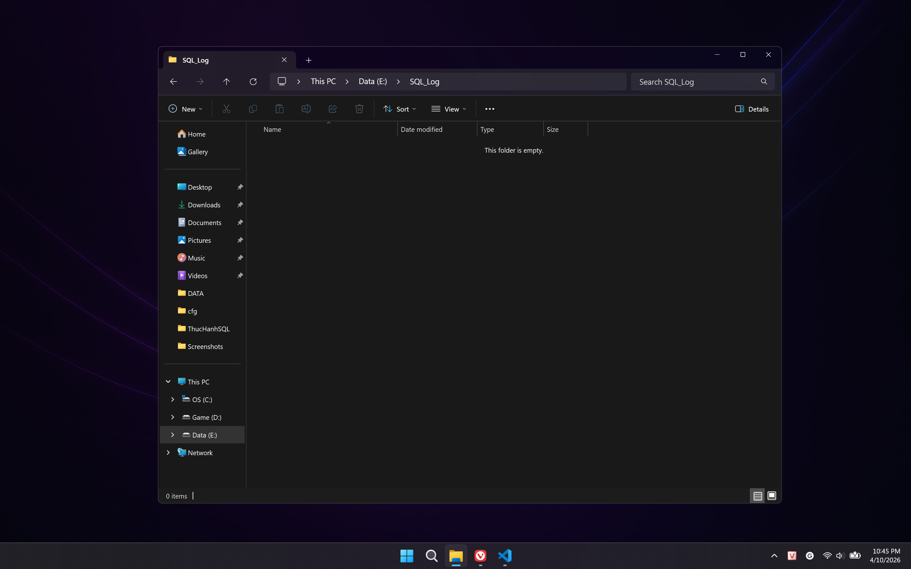

---

## 9. Phục hồi dữ liệu từ file Script (Yêu cầu 16)

Mở file script đã xuất và chạy lại toàn bộ câu lệnh để khôi phục cơ sở dữ liệu và kiểm chứng kết quả.

---

### 9.1 Kết quả phục hồi dữ liệu

Dữ liệu được phục hồi nguyên vẹn sau khi thực thi script.

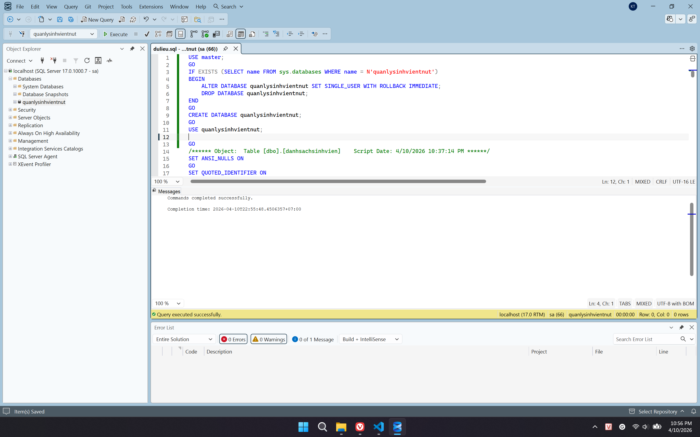

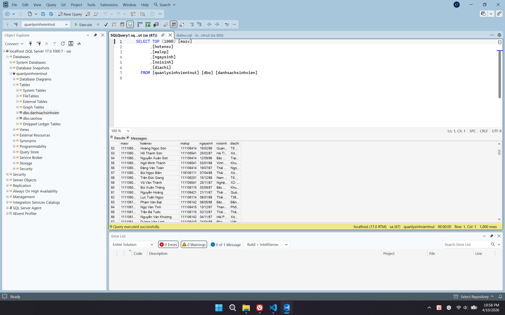

---

# KẾT THÚC BÁO CÁO
