# BÀI KIỂM TRA SỐ 2 – HỆ QUẢN TRỊ CSDL

## Thông tin sinh viên

- Họ tên: TRẦN VĂN KHẢI
- Mã SV: K235480106035
- Chủ đề: Quản lý kho bán gear cho game thủ

---

# PHẦN 1: THIẾT KẾ DATABASE

## Ảnh 1: Tạo Database

- Lệnh SQL:

```sql
CREATE DATABASE [QuanLyGear_K235480106035];
GO
USE [QuanLyGear_K235480106035];
GO
```

- Mục đích: tạo cơ sở dữ liệu cho hệ thống quản lý gear
- Kết quả: database được tạo thành công

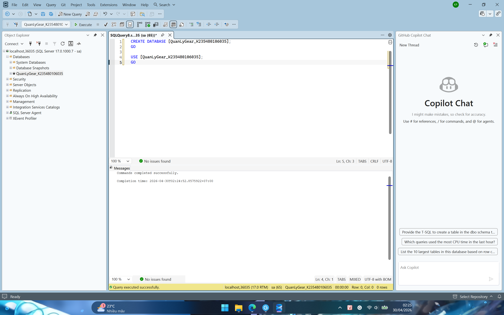

---

## Ảnh 2: Tạo bảng LoaiSanPham

- Lệnh SQL:

```sql
USE [QuanLyGear_K235480106035];
GO

CREATE TABLE [LoaiSanPham] (
    [MaLoai] INT PRIMARY KEY,
    [TenLoai] NVARCHAR(100) NOT NULL
);
GO
```

- Mục đích: lưu loại sản phẩm (chuột, bàn phím,...)
- Kết quả: bảng được tạo thành công

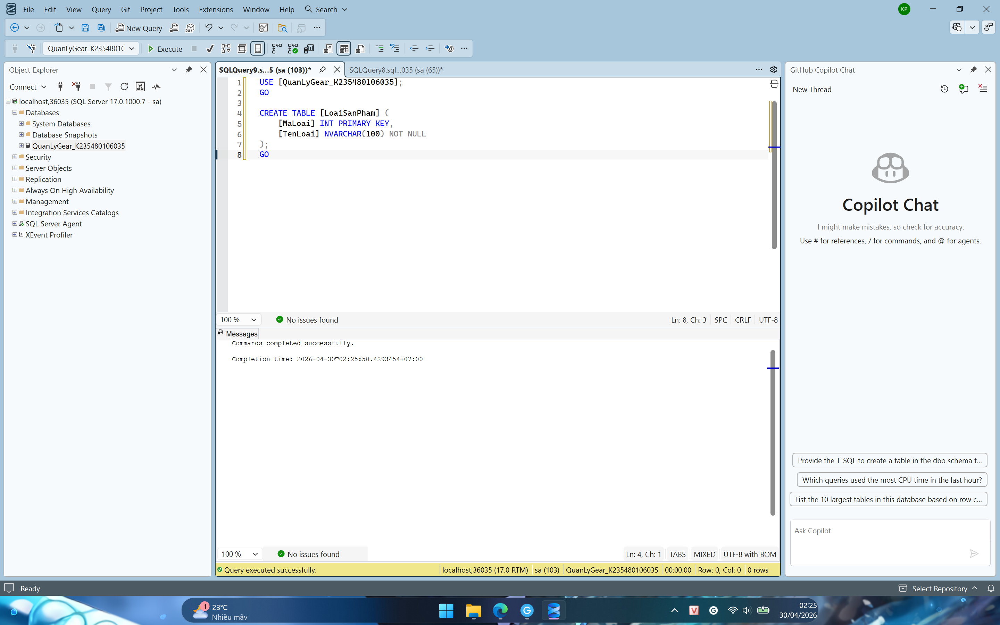

---

## Ảnh 3: Tạo bảng SanPham

```sql
USE [QuanLyGear_K235480106035];
GO

CREATE TABLE [SanPham] (
    [MaSP] INT PRIMARY KEY,
    [TenSP] NVARCHAR(150) NOT NULL,
    [Gia] MONEY CHECK ([Gia] > 0),
    [SoLuongTon] INT CHECK ([SoLuongTon] >= 0),
    [MaLoai] INT
);
GO
```

- Mục đích: lưu thông tin sản phẩm
- Ràng buộc:
  - PK: MaSP
  - CHECK: Giá > 0

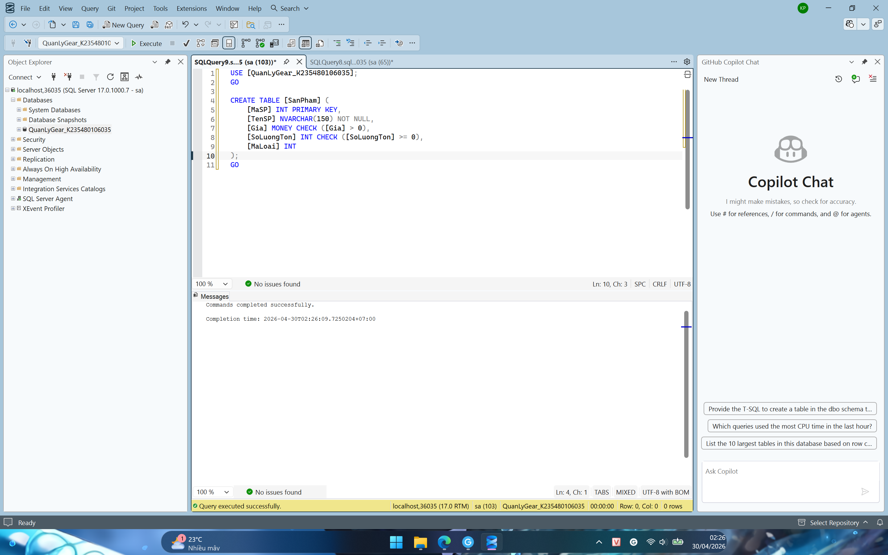

---

## Ảnh 4: Tạo bảng DonHang

```sql
USE [QuanLyGear_K235480106035];
GO

CREATE TABLE [DonHang] (
    [MaDH] INT PRIMARY KEY,
    [NgayDat] DATE DEFAULT GETDATE(),
    [TongTien] MONEY
);
GO
```

- Mục đích: lưu thông tin đơn hàng
- Ràng buộc:
  - PK: MaDH
  - CHECK: TongTien > 0

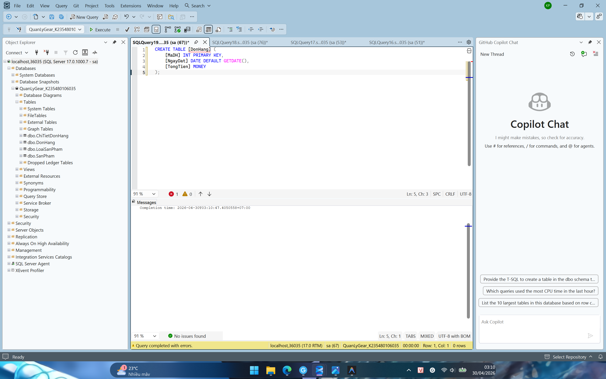

---

## Ảnh 5: Tạo khóa ngoại

```sql
ALTER TABLE [SanPham]
ADD CONSTRAINT FK_SP_Loai
FOREIGN KEY ([MaLoai]) REFERENCES [LoaiSanPham]([MaLoai]);

ALTER TABLE [ChiTietDonHang]
ADD CONSTRAINT FK_CT_DH
FOREIGN KEY ([MaDH]) REFERENCES [DonHang]([MaDH]);

ALTER TABLE [ChiTietDonHang]
ADD CONSTRAINT FK_CT_SP
FOREIGN KEY ([MaSP]) REFERENCES [SanPham]([MaSP]);
```

- Mục đích: liên kết sản phẩm với loại

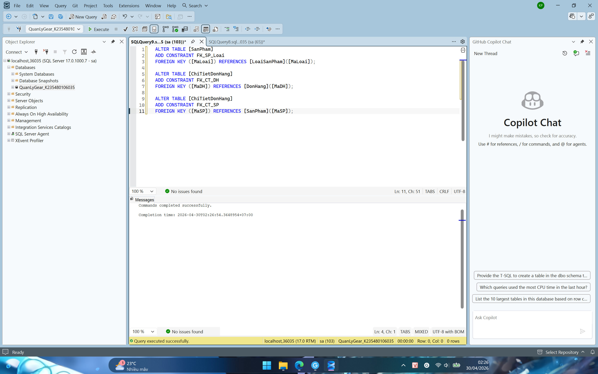

---

# PHẦN 2: FUNCTION

## Ảnh 5: Built-in Function

```sql
SELECT GETDATE() AS NgayHienTai;

SELECT SUM(Gia) AS TongGia
FROM SanPham;

SELECT LEN(N'Gaming Gear') AS DoDaiChuoi;
```

- Ý nghĩa:
  - GETDATE(): lấy ngày hiện tại
  - SUM(): tính tổng giá trị
  - LEN(): tính độ dài chuỗi

    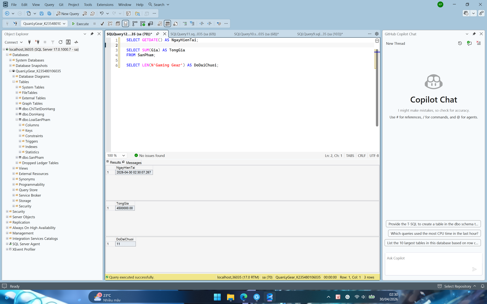

---

## Ảnh 6: Scalar Function – Tính tổng tiền đơn hàng

```sql
CREATE FUNCTION fn_TongTienDon (@MaDH INT)
RETURNS MONEY
AS
BEGIN
    DECLARE @tong MONEY;

    SELECT @tong = SUM(SoLuong * DonGia)
    FROM ChiTietDonHang
    WHERE MaDH = @MaDH;

    RETURN @tong;
END;
GO

SELECT dbo.fn_TongTienDon(1);
```

- Ý nghĩa: Tính tổng tiền đơn hàng
- Mục đích: tính tổng tiền đơn hàng
- Kết quả: trả về tổng tiền

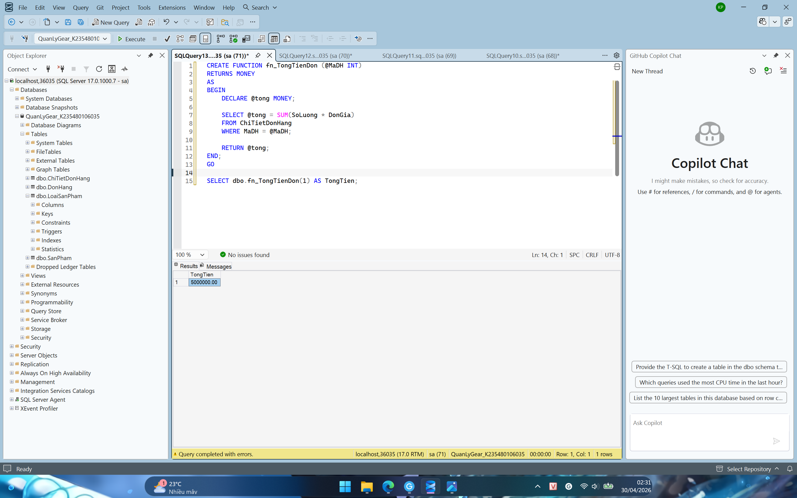

---

## Ảnh 7: Inline Table Function - Lọc sản phẩm sắp hết hàng

```sql
CREATE FUNCTION fn_SP_TonThap (@SoLuong INT)
RETURNS TABLE
AS
RETURN (
    SELECT * FROM SanPham
    WHERE SoLuongTon <= @SoLuong
);
GO

SELECT * FROM fn_SP_TonThap(5);
```

- Ý nghĩa: Lọc sản phẩm sắp hết hàng
- Mục đích: Lọc sản phẩm sắp hết hàng
- Kết quả: Trả về bảng sản phẩm sắp hết hàng

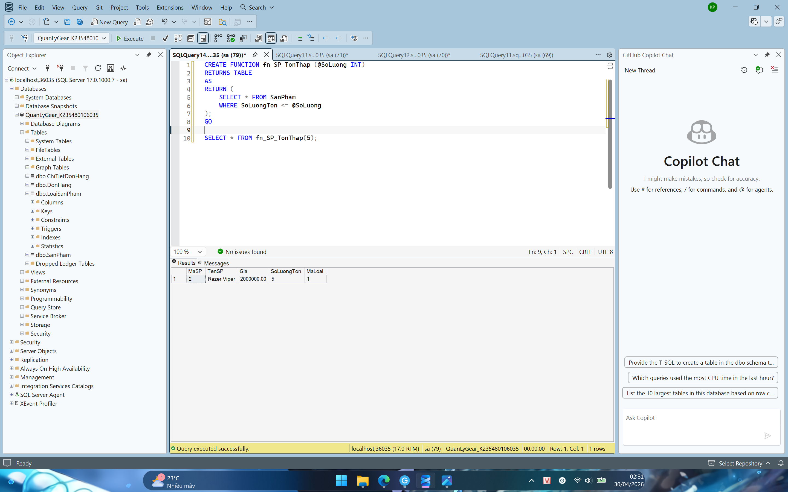

---

## Ảnh 8: Multi-statement Function - Xếp loại sản phẩm

```sql
CREATE FUNCTION fn_XepLoaiSP ()
RETURNS @tbl TABLE (
    MaSP INT,
    TenSP NVARCHAR(150),
    TrangThai NVARCHAR(50)
)
AS
BEGIN
    INSERT INTO @tbl
    SELECT
        MaSP,
        TenSP,
        CASE
            WHEN SoLuongTon = 0 THEN N'Hết hàng'
            WHEN SoLuongTon < 5 THEN N'Sắp hết'
            ELSE N'Còn nhiều'
        END
    FROM SanPham;

    RETURN;
END;
GO

SELECT * FROM dbo.fn_XepLoaiSP();
```

- Ý nghĩa: Xếp loại SP
- Mục đích: Xếp loại SP
- Kết quả: Trả về bảng xếp loại SP

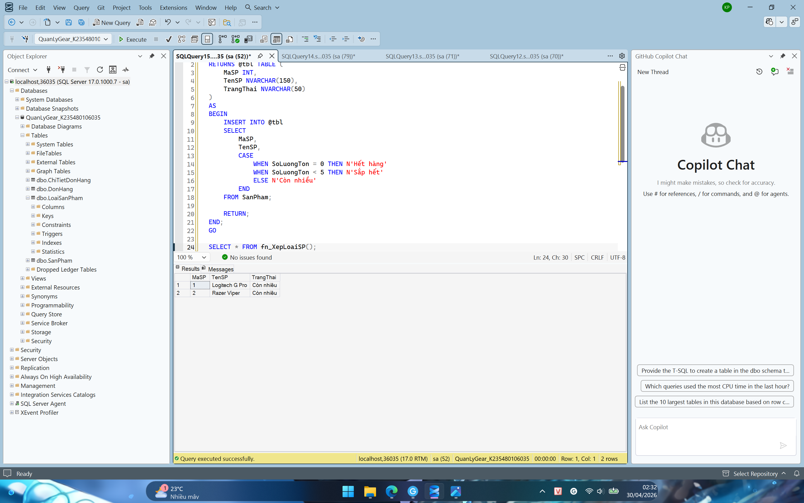

# PHẦN 3: STORED PROCEDURE

## Ảnh 9: SP thêm sản phẩm

```sql
CREATE PROCEDURE sp_ThemSanPham
    @MaSP INT,
    @TenSP NVARCHAR(150),
    @Gia MONEY,
    @SoLuong INT,
    @MaLoai INT
AS
BEGIN
    IF EXISTS (SELECT 1 FROM SanPham WHERE MaSP = @MaSP)
    BEGIN
        PRINT N'Sản phẩm đã tồn tại';
    END
    ELSE
    BEGIN
        INSERT INTO SanPham
        VALUES (@MaSP, @TenSP, @Gia, @SoLuong, @MaLoai);

        PRINT N'Thêm thành công';
    END
END;
GO

```

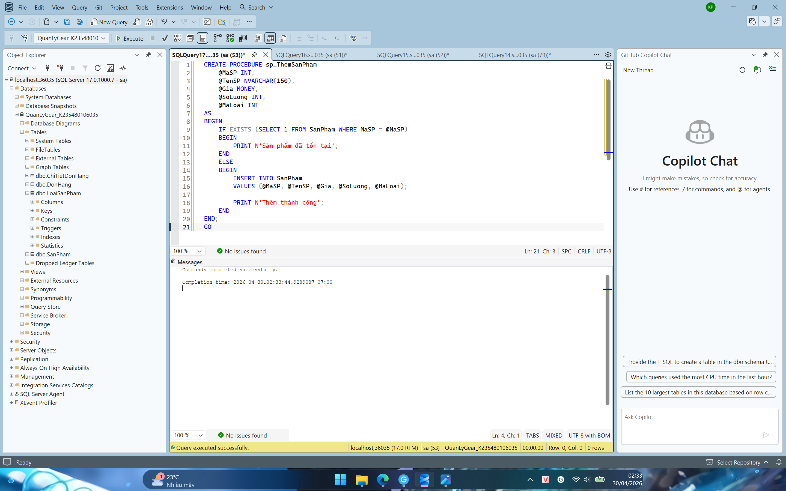

---

- Ý nghĩa: SP thêm sản phẩm
- Mục đích: Thêm sản phẩm vào bảng SanPham
- Kết quả: Thêm sản phẩm vào bảng SanPham

## Ảnh 10: Gọi SP

```sql
EXEC sp_ThemSanPham 4, N'Bàn phím cơ ASUS', 3000000, 10, 2;
```

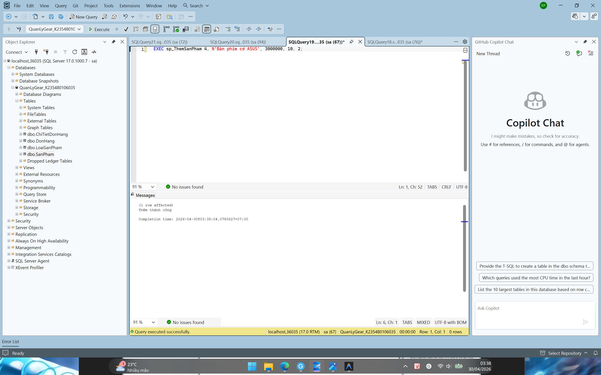

---

- Ý nghĩa: Gọi SP thêm sản phẩm
- Mục đích: Thêm sản phẩm vào bảng SanPham
- Kết quả: Thêm sản phẩm vào bảng SanPham

# PHẦN 4: TRIGGER VÀ XỬ LÝ NGHIỆP VỤ

## Ảnh 1: Trigger tự động trừ kho khi bán hàng

```sql
CREATE OR ALTER TRIGGER trg_TruKhoSauBan
ON [ChiTietDonHang]
AFTER INSERT
AS
BEGIN
    -- Kiểm tra bán vượt tồn
    IF EXISTS (
        SELECT 1
        FROM inserted i
        JOIN SanPham sp ON sp.MaSP = i.MaSP
        WHERE i.SoLuong > sp.SoLuongTon
    )
    BEGIN
        PRINT N'Không đủ hàng trong kho';
        ROLLBACK TRANSACTION;
        RETURN;
    END;

    -- Trừ kho
    UPDATE sp
    SET sp.SoLuongTon = sp.SoLuongTon - i.SoLuong
    FROM SanPham sp
    JOIN inserted i ON sp.MaSP = i.MaSP;
END;
GO
```

- Ý nghĩa: Trigger tự động trừ kho khi bán hàng
- Mục đích: Khi thêm chi tiết đơn hàng, hệ thống tự động trừ số lượng tồn kho
- Kết quả: Sau khi insert, SoLuongTon giảm tương ứng

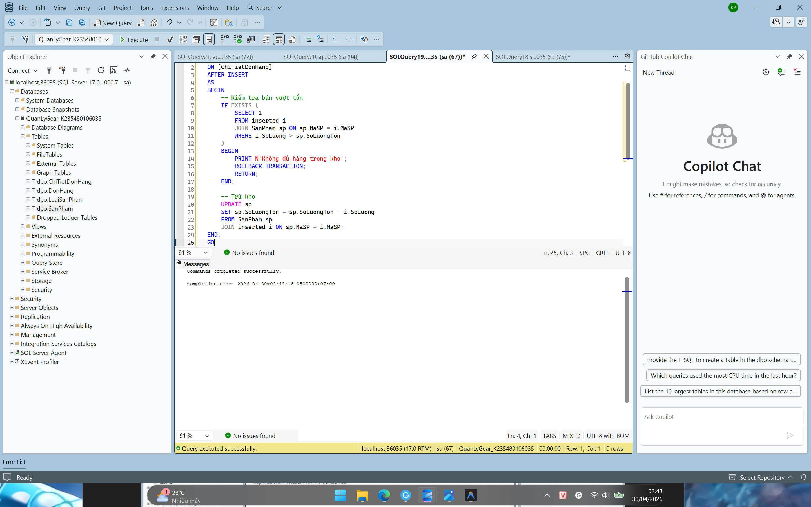

---

## Ảnh 2: Test trigger (trước khi bán)

```sql
USE [QuanLyGear_K235480106035];
GO

-- Đảm bảo có sản phẩm
SELECT * FROM SanPham WHERE MaSP = 1;

-- Tạo đơn hàng (bảng CHA)
INSERT INTO DonHang VALUES (100, GETDATE(), NULL);

-- Kiểm tra trước khi bán
PRINT N'Trước khi bán';
SELECT * FROM SanPham WHERE MaSP = 1;

GO
```

- Mục đích: kiểm tra trigger hoạt động trước khi insert

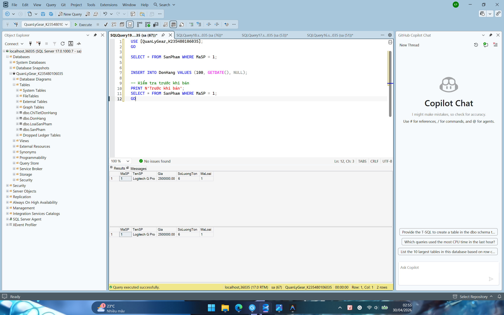

---

## Ảnh 2.1: Trigger chạy thành công

```sql
INSERT INTO ChiTietDonHang VALUES (100, 2, 1, 2000000);

```

- Mục đích: kiểm tra trigger hoạt động sau khi insert

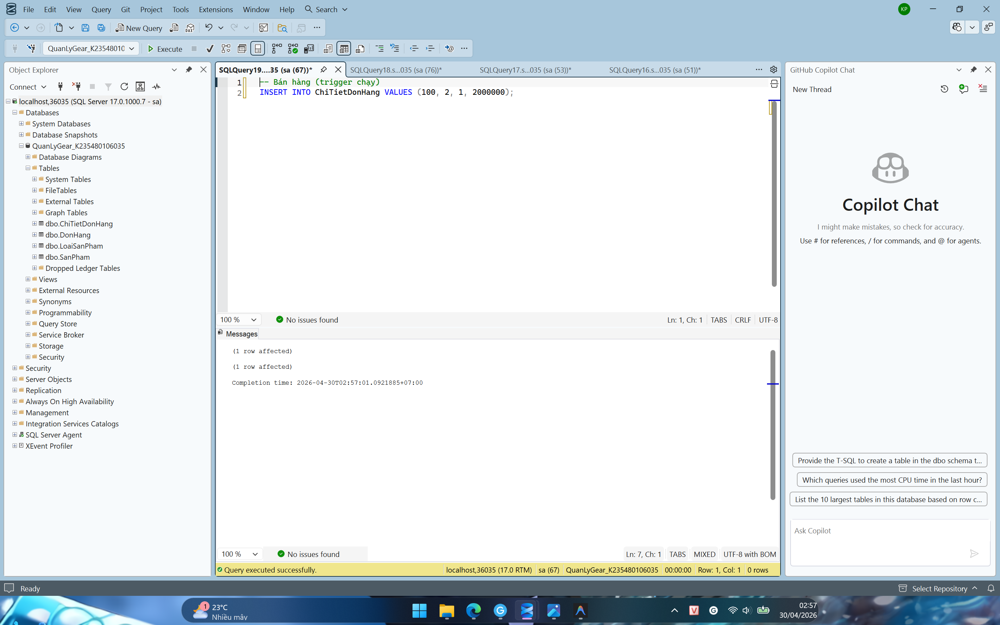

---

## Ảnh 2.2: Kiểm tra insert sau khi trigger chạy thành công

```sql
PRINT N'Sau khi bán';
SELECT * FROM SanPham WHERE MaSP = 1;

```

- Ý nghĩa: Kiểm tra insert sau khi trigger chạy thành công
- Mục đích: Kiểm tra trigger hoạt động sau khi insert
- Kết quả: Sau khi insert, SoLuongTon giảm tương ứng

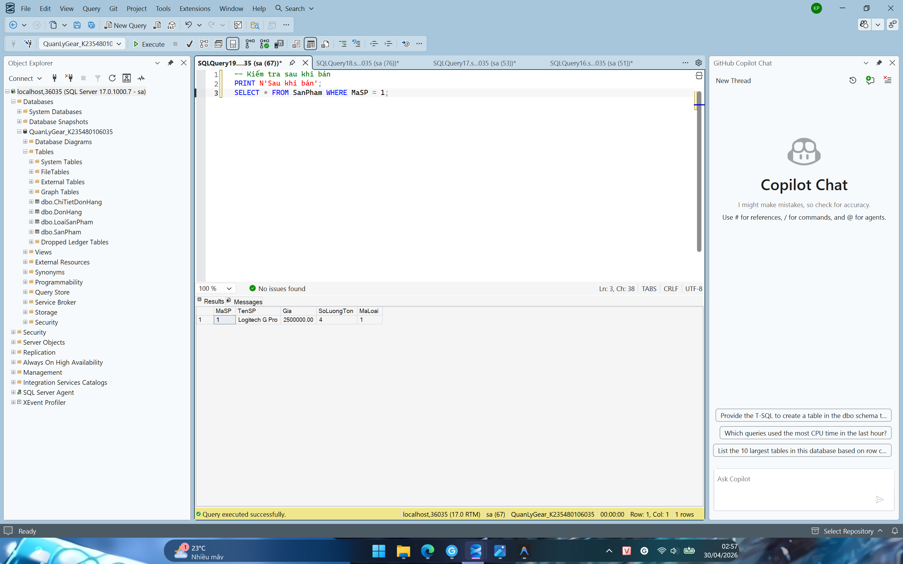

---

## Ảnh 3: Trigger từ bảng A → B

```sql
CREATE TRIGGER trg_SP_Update_DH
ON SanPham
AFTER UPDATE
AS
BEGIN
    UPDATE DonHang
    SET TongTien = ISNULL(TongTien,0) + 1
    WHERE MaDH = 100;
END;
GO
```

- Mục đích: Khi cập nhật sản phẩm thì cập nhật đơn hàng

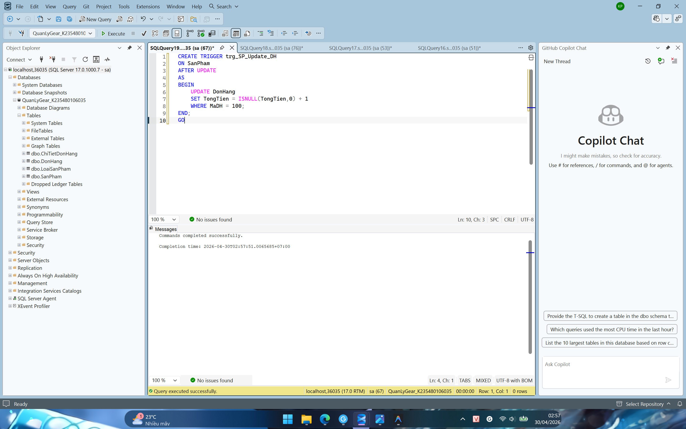

---

## Ảnh 4: Trigger từ bảng B → A

```sql
CREATE TRIGGER trg_DH_Update_SP
ON DonHang
AFTER UPDATE
AS
BEGIN
    UPDATE SanPham
    SET SoLuongTon = SoLuongTon + 1
    WHERE MaSP = 1;
END;
GO
```

- Mục đích: Khi cập nhật đơn hàng thì cập nhật lại sản phẩm

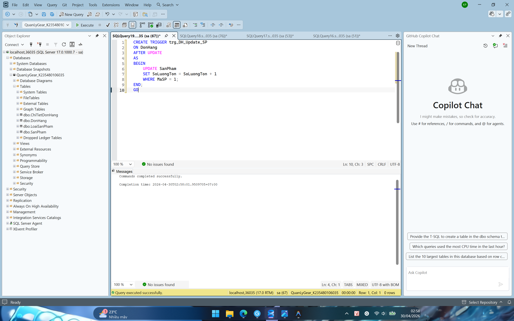

---

## Ảnh 5: Lỗi vòng lặp trigger

```sql
UPDATE SanPham
SET SoLuongTon = SoLuongTon + 1
WHERE MaSP = 1;
```

- Kết quả hệ thống:

```
Maximum stored procedure, function, trigger, or view nesting level exceeded (limit 32)
```

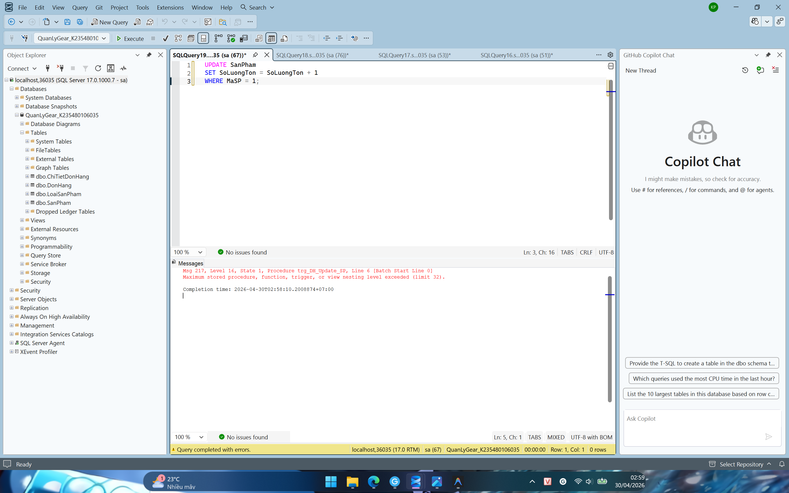

---

## Nhận xét

- Khi trigger ở bảng A cập nhật bảng B, và trigger ở bảng B cập nhật ngược lại bảng A, hệ thống sẽ tạo vòng lặp vô hạn
- SQL Server tự động dừng sau 32 lần lặp và báo lỗi
- Đây là thiết kế không tốt trong thực tế

---

## Kết luận phần Trigger

- Trigger giúp tự động hóa xử lý dữ liệu
- Tuy nhiên cần thiết kế một chiều để tránh vòng lặp
- Không nên sử dụng trigger chồng nhau

---

# PHẦN 5: CURSOR VÀ DUYỆT DỮ LIỆU

## Ảnh 6: Sử dụng Cursor

```sql
DECLARE cur_DH CURSOR FOR
SELECT MaDH FROM DonHang;

DECLARE @MaDH INT;
DECLARE @Tong MONEY;

OPEN cur_DH;
FETCH NEXT FROM cur_DH INTO @MaDH;

WHILE @@FETCH_STATUS = 0
BEGIN
    SELECT @Tong = SUM(SoLuong * DonGia)
    FROM ChiTietDonHang
    WHERE MaDH = @MaDH;

    PRINT N'Đơn hàng ' + CAST(@MaDH AS NVARCHAR)
        + N' có tổng tiền: ' + CAST(@Tong AS NVARCHAR);

    FETCH NEXT FROM cur_DH INTO @MaDH;
END;

CLOSE cur_DH;
DEALLOCATE cur_DH;
```

- Mục đích: duyệt từng đơn hàng và xử lý riêng từng bản ghi
- Kết quả: in ra tổng tiền của từng đơn hàng

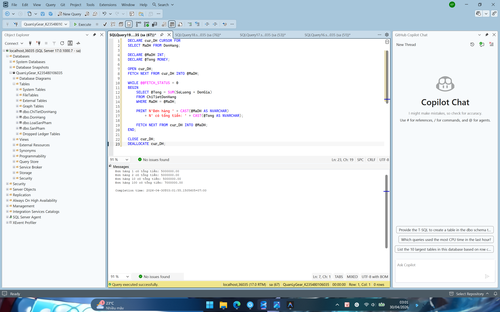

---

## Ảnh 7: Không dùng Cursor (SQL thuần)

```sql
SELECT
    MaDH,
    SUM(SoLuong * DonGia) AS TongTien
FROM ChiTietDonHang
GROUP BY MaDH;
```

- Mục đích: tính tổng tiền theo cách tối ưu hơn
- Kết quả: trả về danh sách tổng tiền

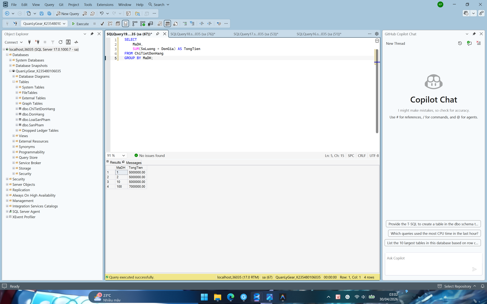

---

## So sánh

---

| Tiêu chí   | Cursor         | SQL thường       |
| ---------- | -------------- | ---------------- |
| Tốc độ     | Chậm           | Nhanh            |
| Cách xử lý | từng dòng      | tập hợp          |
| Khi dùng   | logic phức tạp | đa số trường hợp |

---

---

## Nhận xét

- Cursor xử lý từng dòng nên chậm hơn
- SQL thuần tối ưu hơn trong đa số trường hợp
- Cursor chỉ nên dùng khi cần xử lý logic riêng từng bản ghi

---

## Kết luận phần Cursor

- Cursor hữu ích nhưng không nên lạm dụng
- Nên ưu tiên SQL dạng tập hợp để đạt hiệu năng tốt hơn

* Đã xây dựng đầy đủ hệ thống quản lý kho gear
* Áp dụng Function, Procedure, Trigger, Cursor
* Hiểu rõ cách tổ chức và xử lý dữ liệu trong SQL Server
